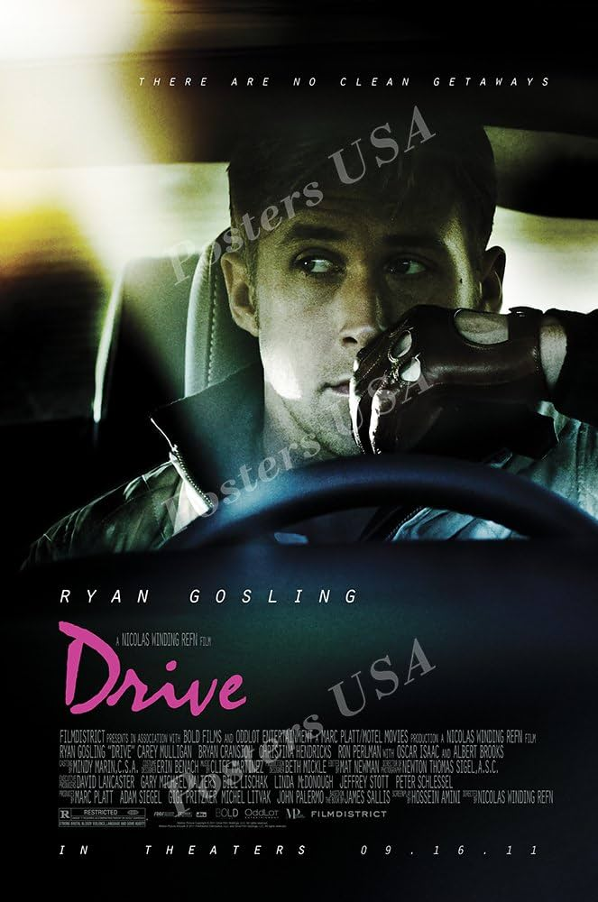
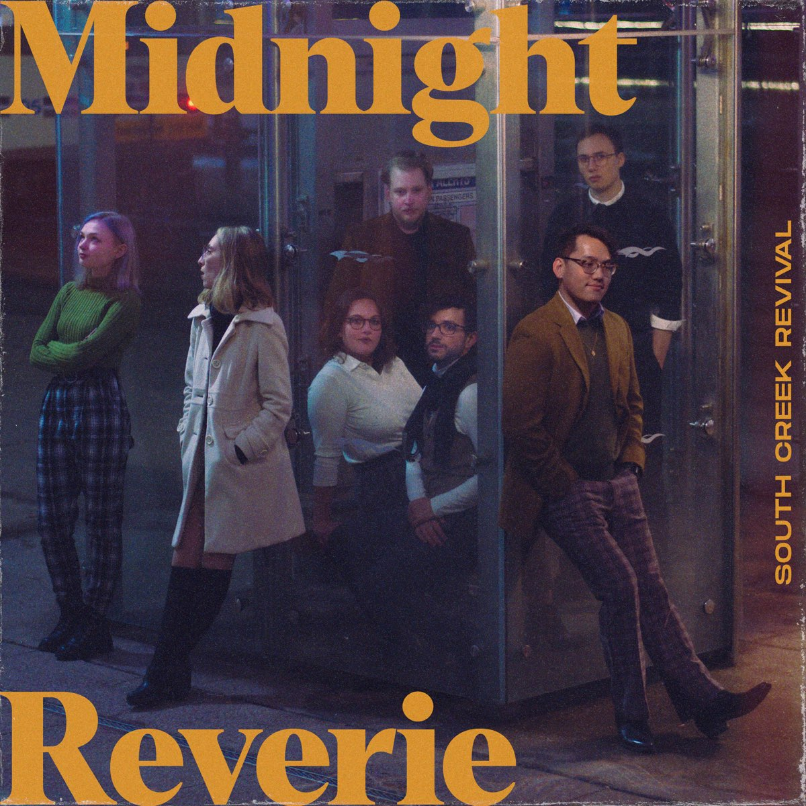
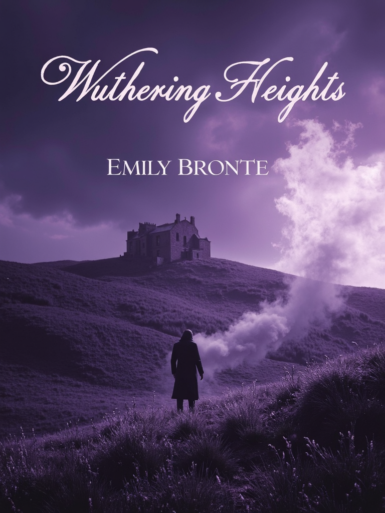
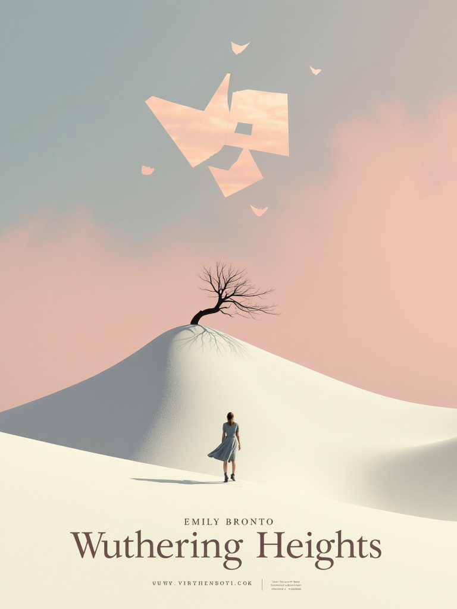
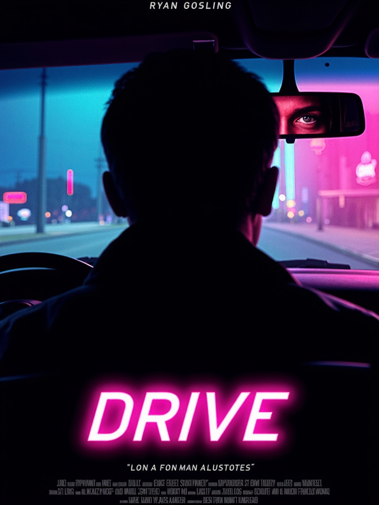
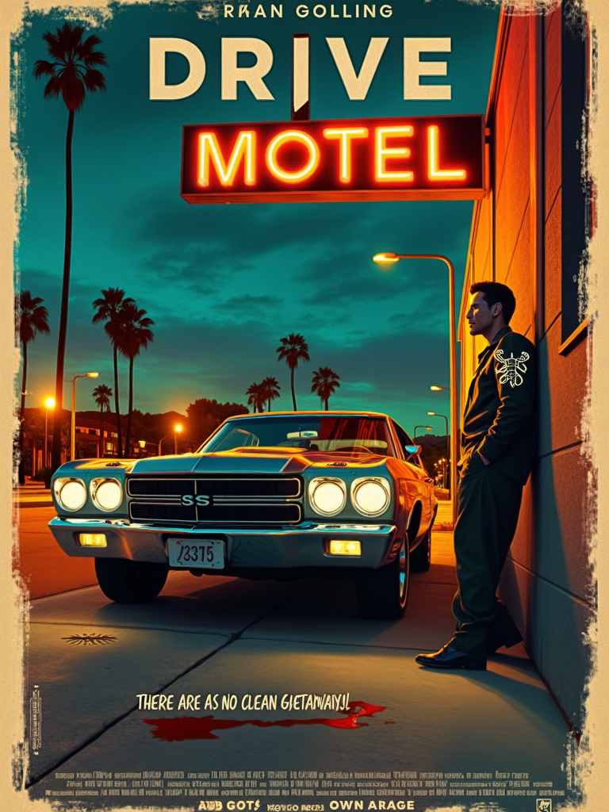
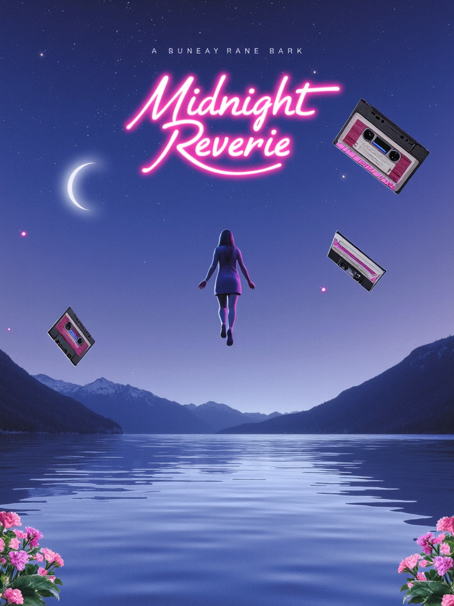
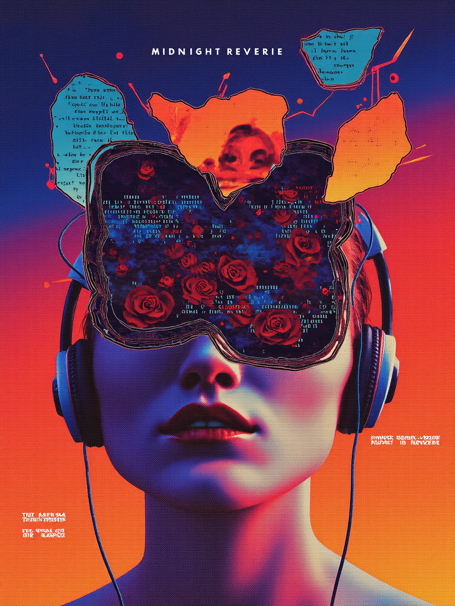
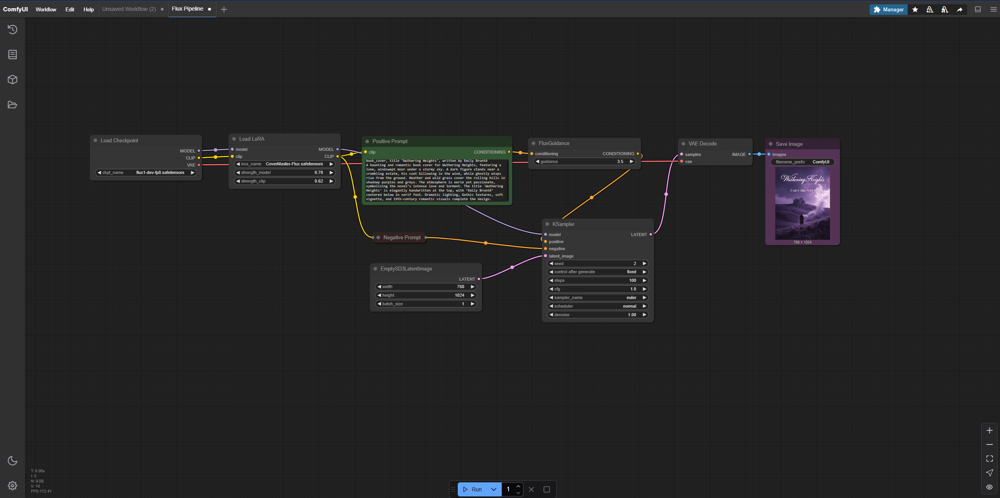

# Art Capstone Final Report

## Original Works

### 1. Book: The Little Prince

### 2. Movie: The Dark Knight

### 3. Music Album: Supermode “Tell Me Why”

---

## AI-Generated Variations

### 1. Book Cover Variations

### 2. Movie Poster Variations

### 3. Music Album Cover Variations

---

## Workflow

1. **Image generation model used**  
   - **Model:** flux1-dev by Comfy-Org  
     - **Checkpoint:** `flux1-dev-fp8.safetensors`  
     - **Link:** https://huggingface.co/Comfy-Org/flux1-dev

2. **LoRAs / Adapters / Extensions**  
   - **Book variant LoRA:** [book-cover-or-flux](https://civitai.com/models/793367/book-cover-or-flux)  
   - **Movie variant LoRA:** [movie-cover](https://civitai.com/models/1388823/movie-cover)  
   - **Album variant LoRA:** [cover-master-flux](https://civitai.com/models/1073657/cover-master-flux)

3. **Technical generation details**  
   - **Steps:** 50  
   - **CFG Scale:** 1  
   - **Sampler:** Euler A  
   - **Resolution:** 768×1024 (all)  
   - **Denoising strength:** 1  
   - **Precision:** FP16 with upcast cross-attention to float32  

4. **Pipeline configuration**  
   

5. **Prompts used**  
   - **Book:**  
     1. _book_cover, title "Wuthering Heights", written by Emily Brontë A haunting and romantic book cover for *Wuthering Heights*, featuring a lone, windswept moor under a stormy sky. A dark figure stands near a crumbling estate, his coat billowing in the wind, while ghostly wisps rise from the ground. Heather and wild grass cover the rolling hills in shadowy purples and greys. The atmosphere is eerie yet passionate, symbolizing the novel’s intense love and torment. The title 'Wuthering Heights' is elegantly handwritten at the top, with ‘Emily Brontë’ centered below in serif font. Dramatic lighting, Gothic textures, soft vignette, and 19th-century romantic visuals complete the design._  
     2. _book_cover, title "Wuthering Heights", written by Emily Brontë A surreal and minimalist book cover for *Wuthering Heights*, featuring a stark, dreamlike landscape of pale dunes blending into a foggy, pastel sky. A single leafless tree stands twisted in the center, casting a long shadow, while a translucent silhouette of a woman fades into the horizon. Abstract shapes resembling birds and broken windows float overhead, evoking isolation and memory. The color palette is soft and desaturated—dusty pinks, faded blues, and ivory. The title ‘Wuthering Heights’ is typed in a bold modern sans-serif at the bottom, with ‘Emily Brontë’ placed subtly in the corner. Clean lines, negative space, ethereal ambiance, and contemporary design aesthetics define the composition._  
   - **Movie:**  
     1. _movie_cover, A moody, minimalist poster for the film Drive (2011), starring Ryan Gosling. The poster features a rear-view silhouette of the Driver inside a car at night, with neon lights glowing on the windshield. In the mirror, his eyes are barely visible, lit with faint pink and blue hues from Los Angeles signage. The scorpion jacket rests on the passenger seat. The title 'DRIVE' appears in bold pink script at the bottom left, with the tagline “There are no clean getaways” in faint white. Retro synthwave palette, minimalist layout, grainy texture, with strong 80s noir aesthetic and emotional tension._  
     2. _movie_cover, A hand-painted, vintage noir poster for the film *Drive* (2011), starring Ryan Gosling The poster shows the Driver leaning against his 1973 Chevy Malibu under a flickering motel sign, with dusk falling over a gritty LA street. Painted brushstrokes emphasize shadows and motion, with bold contrasts of amber streetlights and deep teal night tones. The scorpion glows faintly on his back as he gazes off-screen, suggesting quiet intensity. A stylized blood smear forms a diagonal across the scene, adding suspense. The title ‘DRIVE’ is rendered in distressed block letters at the top, and the tagline “There are no clean getaways” appears handwritten beneath the car. Classic pulp illustration style, textured paper background, 1970s crime drama mood, and expressive color grading._  
   - **Album:**  
     1. _music_cover, Design a surreal, dreamy album cover for a shoegaze band titled "Midnight Reverie" The scene shows a figure levitating over a quiet lake at night, surrounded by floating cassette tapes, flowers, and moons. The water reflects a galaxy sky, while faint waves ripple outward. The album title "Midnight Reverie" is handwritten in glowing pink, curving like constellations across the top. Pastel blue, lavender, and silvery tones dominate the scene. Dreamy haze, soft blur, vintage film grain, and nostalgic atmosphere reminiscent of 90s bedroom pop._  
     2. _music_cover, Design a bold, abstract album cover for a shoegaze band titled "Midnight Reverie" The cover features an amorphous collage of fragmented mirrors, tangled headphone cords, and blooming roses swirling around a faceless figure dissolving into static. The background fades from deep indigo to burnt orange, layered with glitch textures and halftone patterns. Randomized lyrics float faintly in the corners like torn paper scraps. The album title "Midnight Reverie" is stamped in bold typewriter font at the center, partially obscured by digital distortion. Clashing yet harmonious hues—magenta, rust, and cyan—form a chaotic harmony. Experimental layout, analog-meets-digital distortion, raw DIY aesthetic, channeling late-night loneliness and beautiful noise._  

6. **Resources used**  
   - **WebUI:** ComfyUI with Flux v1 (runned locally)  
   - **Environment:** Python 3.10.6, Windows 11 24H2
   - **Hardware:** NVIDIA RTX 5070 (12 GB VRAM), Intel Core i7-14700K, 64 GB RAM

